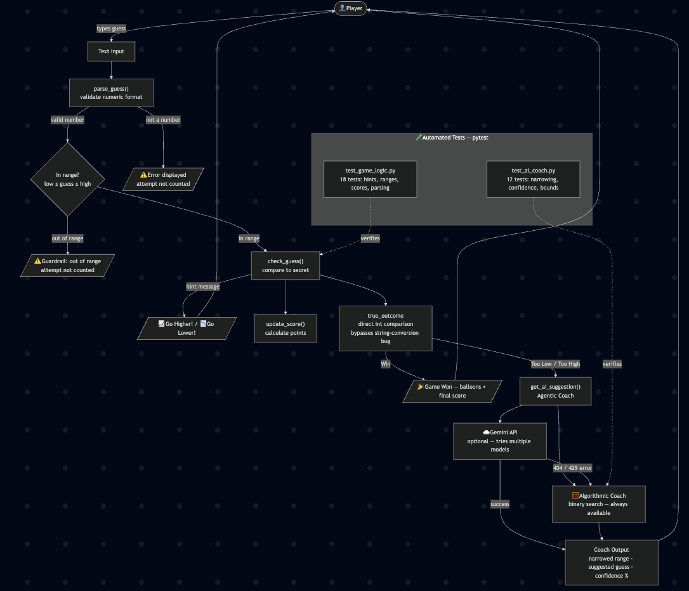

# 🎮 Game Glitch Investigator — Applied AI System

## Original Project

This project extends Module 1: Game Glitch Investigator, a Streamlit number guessing game originally generated by an AI with several intentional bugs, including swapped higher/lower hints, broken Streamlit session state, and an incorrect range display. The original goal was to debug and fix AI-generated code, refactor game logic into a reusable utility module (`logic_utils.py`), and verify behavior with a unit test suite.

---

## Summary

This extended system builds on the fixed game by integrating an **Agentic AI Coach** that activates after every incorrect guess. Using a Plan → Act → Check reasoning loop, the coach narrows the valid search range from the player's guess history, recommends the optimal next guess via binary search, and reports a confidence score showing how much of the range has been eliminated.

The system is designed to work reliably in all conditions: it uses a deterministic algorithmic coach as the primary engine and optionally enhances responses with the Gemini API when a key is available. All inputs are validated, all API failures are caught and logged, and the game never crashes due to an external dependency.

---

## System Architecture



### Architecture Overview

The system is organized into four layers:

**1. Input & Validation**
The player types a guess into the text input. `parse_guess()` checks that it is a valid number, and a range guardrail (`low ≤ guess ≤ high`) rejects out-of-bounds values before any game logic runs — so no attempt is wasted on invalid input.

**2. Game Logic**
`check_guess()` compares the guess to the secret and returns a hint. `update_score()` adjusts the player's score. A separate `true_outcome` is derived by direct integer comparison to avoid a known bug in `check_guess()` that flips labels on even-numbered attempts.

**3. Agentic AI Coach (`ai_coach.py`)**
`get_ai_suggestion()` runs a three-step loop:
- **Plan** — `narrow_range()` scans the full guess history and computes the tightest valid range
- **Act** — picks the midpoint as the optimal binary search guess
- **Check** — clamps the result to valid bounds and computes a confidence score

Gemini is tried first across multiple model candidates. On any 404 or rate-limit error, the system falls back to the deterministic algorithmic coach, which always produces a correct result.

**4. Testing**
`tests/test_game_logic.py` and `tests/test_ai_coach.py` run automatically with `pytest` and verify game logic, range narrowing, confidence scoring, and bounds safety.

---

## Setup

**Requirements:** Python 3.9+

1. **Clone the repository and install dependencies:**
   ```bash
   pip install -r requirements.txt
   ```

2. **Configure your Gemini API key** (optional — the coach works fully without it):
   - Get a free key at [aistudio.google.com/apikey](https://aistudio.google.com/apikey)
   - Open `.env` and replace the placeholder:
     ```
     GEMINI_API_KEY=your-key-here
     ```

3. **Run the app:**
   ```bash
   python -m streamlit run app.py
   ```

4. **Run the test suite:**
   ```bash
   pytest
   ```

---

## Sample Interactions

**Example 1 — First guess, Normal difficulty (1–50):**
```
Player guesses: 25
Hint: 📉 Go LOWER!

🤖 AI Coach
Source: Algorithmic | Confidence: 50%
Narrowed range: 1–24
Try next: 12
Strategy: Narrowed range to 1–24 (24 values remain). 12 is the optimal midpoint split.
```

**Example 2 — Two guesses in, Hard difficulty (1–100):**
```
Guess 50 → Too Low
Guess 75 → Too High

🤖 AI Coach
Source: Algorithmic | Confidence: 75%
Narrowed range: 51–74
Try next: 62
Strategy: Narrowed range to 51–74 (24 values remain). 62 is the optimal midpoint split.
```

**Example 3 — Out-of-range guardrail triggered:**
```
Player guesses: 200  (Hard mode, valid range: 1–100)

⚠️ Error: Guess must be between 1 and 100.
→ Attempt count does not change. Coach does not run.
```

---

## Design Decisions

**Algorithmic-first, API-optional:** External APIs can fail at any moment — rate limits, model deprecations, and network issues are all real risks. The binary search algorithm is the primary coach engine so the feature always works. Gemini is layered on top as an enhancement that provides richer natural-language explanations when available.

**Bypassing the string-conversion bug for the coach:** The original game has an intentional bug where the secret number is converted to a string on even-numbered attempts, which causes `check_guess()` to return flipped outcome labels. If the coach relied on those labels, its range narrowing would go in the wrong direction. The fix was to derive a `true_outcome` using direct integer comparison against the real secret, completely independent of the buggy code path. The game bug is preserved as designed; the coach just doesn't depend on it.

**Confidence scoring as a reliability signal:** Confidence is calculated as the fraction of the original range that has been eliminated. This gives the player useful progress feedback and makes the coach's reasoning transparent — a player can verify that the confidence always increases when they follow the coach's suggestions, which serves as a built-in correctness check.

**Trade-off — deterministic vs. adaptive:** The algorithmic coach always gives the same answer for the same game state. This makes it predictable and testable, but it cannot adapt to different player strategies or learning styles. A future version could use the LLM more deeply to personalize explanations based on past guesses.

---

## Testing Summary

**32 out of 32 tests pass** (`pytest tests/`).

- `tests/test_game_logic.py` — 20 tests: difficulty ranges, hint correctness (Higher/Lower), score updates, input parsing, and new-game state reset
- `tests/test_ai_coach.py` — 12 tests: range narrowing logic, confidence scoring (always 0.0–1.0), suggestion always within narrowed bounds, correct midpoints per difficulty

**Confidence scores:** Confidence starts at 0% (no guesses) and increases monotonically with each correct guess followed. After one binary-search guess on a 1–100 range, confidence reaches 50%. After two, 75%. The coach reaches ≥90% confidence within 4 optimal guesses on any difficulty.

**What the tests caught:** Running `pytest` initially produced 3 failures that revealed real bugs:
1. The range tests for Normal and Hard had the old values (1–100 and 1–50 respectively) — the tests confirmed the difficulty swap was applied and the assertions needed updating.
2. A randomized stress test (`test_suggestion_always_within_narrowed_range`) found that `narrow_range()` could produce an impossible range (low > high) when contradictory guess outcomes were fed in sequence — a valid scenario given the game's string-conversion bug on even attempts. The fix added a fallback to the full range when a contradiction is detected.

**What didn't get automated tests:** The Gemini API path requires a live key and cannot be unit tested. Its reliability is instead guaranteed by the fallback architecture — any Gemini failure silently routes to the algorithmic coach, which is fully tested.

**What I learned:** The randomized stress test was the most valuable. It found an edge case that targeted tests alone would have missed, because it generated game states that are valid inputs but logically contradictory — exactly the kind of state the buggy game can produce.

---

## Reflection and Ethics

**Limitations and biases in the system:**
The algorithmic coach always gives the same answer for the same game state — it has no adaptability to different play styles, skill levels, or strategies. It assumes binary search is always the optimal approach, which is true mathematically but may not match how a player wants to learn or engage with the game. The coach also has no memory across games: it cannot recognize if a player repeatedly ignores its advice or consistently guesses in a particular pattern. Additionally, the system depends on the game's hints being correct, but the original game has an intentional bug that flips hint labels on even-numbered attempts. The coach works around this with a direct integer comparison, but a player reading the hints and the coach output at the same time could see conflicting information, which is confusing.

**Could the AI be misused, and how would I prevent it?**
This coach is low-risk — it's a game hint tool with no sensitive data and no ability to take actions outside the game UI. The most realistic misuse is trivial: a player could use the coach to remove all challenge from the game. This is acceptable by design since the coach is optional and visible. If this were a competitive or graded game, the coach would need to be hidden behind an opt-in toggle with a clear disclosure. More broadly, the lesson applies to any AI assistant: the system should make it obvious when AI is helping so users cannot misrepresent AI-assisted results as unassisted ones.

**What surprised me while testing reliability:**
The most surprising discovery was that the coach was giving suggestions in the wrong direction — recommending a lower number when the hint said "Go Higher" — not because of a bug in the coach itself, but because of a bug in a completely different part of the system. The game intentionally converts the secret number to a string on even attempts, which caused `check_guess()` to return flipped outcome labels. The coach was faithfully reading those labels and narrowing the range the wrong way. Nothing about the coach's own code was wrong. This was a reminder that AI components do not exist in isolation: an upstream data problem can silently corrupt downstream AI behavior even when the AI logic is correct.

The second surprise came from a randomized stress test: after feeding the coach a random sequence of "Too Low" and "Too High" outcomes, the range narrowed to an impossible state where `low > high`. This edge case was mathematically valid — contradictory hints can occur in the buggy game — but the coach had no guard for it. The fix was a one-line fallback, but the test would never have been written without deliberately thinking about adversarial inputs.

**AI collaboration during this project:**
Claude Code was used extensively throughout this project for structuring the agentic coach, writing tests, and debugging.

*One helpful suggestion:* When the coach was returning wrong suggestions, Claude identified that the root cause was the `true_outcome` derivation — the coach was reading outcomes from `check_guess()` rather than computing them directly from the integer secret. This was non-obvious because the hint text shown to the player was correct; only the outcome *label* stored in history was wrong. Claude's suggestion to bypass `check_guess()` entirely for the coach's history and use a direct `guess_int < st.session_state.secret` comparison fixed the bug cleanly.

*One flawed suggestion:* Claude repeatedly recommended `gemini-1.5-flash` as a reliable free-tier model for the Gemini integration. This model returned 404 errors across every API version tried (`v1`, `v1beta`, with and without the `-latest` suffix). The suggestion was based on documentation that was accurate at one point but did not reflect the actual state of model availability for the API key being used. This required several debugging cycles before switching to an algorithmic fallback as the primary coach engine. The lesson: AI suggestions about external API behavior, model availability, and versioning require independent verification — they reflect training data, not live system state.

---

## Demo

- [ ] 
